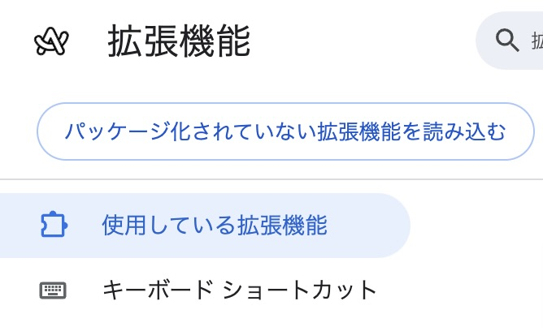

# Citation Generator Chrome Extension

このChrome拡張機能は、学術論文の引用を簡単に生成するためのツールです。BibTeXと文中引用の形式に対応しています。


## インストール手順

1. GitHubからZIPファイルをダウンロード：
   1. GitHubリポジトリのページで緑色の「Code」ボタンをクリック
   2. ドロップダウンメニューから「Download ZIP」を選択
   3. ダウンロードしたZIPファイルを適当な場所に解凍

2. Google ChromeまたはArcを開き、アドレスバーに以下を入力します：
   ```
   chrome://extensions/
   ```

   または

   ```
   arc://extensions/
   ```

3. 右上の「デベロッパーモード」をONにします

4. 左上に表示される「パッケージ化されていない拡張機能を読み込む」をクリックします
   

5. 解凍したフォルダを選択します
> [!IMPORTANT] フォルダに注意！
> `citation maker`フォルダを選択してください
  
6. 拡張機能が正しく読み込まれると、Chrome拡張機能の一覧に「Citation Format Generator」が表示されます

## 使用方法

1. Chrome拡張機能のアイコンをクリックして、Citation Generatorを開きます

2. 以下のいずれかの方法で引用情報を入力：
   - 「Fetch Metadata」ボタンをクリックして、現在開いているWebページの情報を自動取得
   - 手動で以下の情報を入力：
     - タイトル
     - 著者
     - 出版年

> [!WARNING] 注意
> 出版年に関してがうまく取れないことがあるので注意してください

1. 入力された情報から自動的にBibTeXと文中引用が生成されます

2. 引用をコピー：
   - 「Copy BibTeX」: BibTeX形式の引用をクリップボードにコピー
   - 「Copy Citation」: 文中引用形式をクリップボードにコピー

3. 入力をクリアする場合は「Clear All」ボタンをクリック

## トラブルシューティング

- 拡張機能が表示されない場合：
  - デベロッパーモードが有効になっているか確認してください
  - manifest.jsonの内容が正しいか確認してください
  - Chromeを再起動してみてください

- エラーが表示される場合：
  - Chromeのコンソールでエラーメッセージを確認してください
  - 必要なファイルがすべて正しい場所にあるか確認してください

## 開発者向け情報

拡張機能の構造：
```
citation-generator/
├── manifest.json
├── popup.html
├── popup.js
└── icons/
    └── citation-icon-16.png
    └── citation-icon-48.png
    └── citation-icon-128.png
```

## サポート

問題や提案がある場合は、GitHubのIssueトラッカーを使用してください。